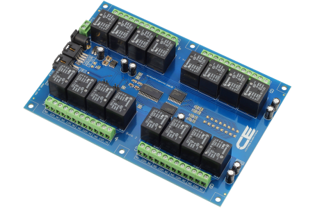

[](https://www.controleverything.com/content/Relay-Controller?sku=MCP23017_I2CR16G5LE_10A)
# MCP23017
MCP23017 I2C Relay Controller 16-Channel

The MCP23017 is a Integrated port expander that controls 16 relays through the I2C bus.

This Device is available from ControlEverything.com [SKU: MCP23017_I2CR8G5LE_I2CS]

https://www.controleverything.com/content/Relay-Controller?sku=MCP23017_I2CR16G5LE_10A

This Sample code can be used with Raspberry pi, Arduino and Particle.

##Java 
Download and install pi4j library on Raspberry pi. Steps to install pi4j are provided at:

http://pi4j.com/install.html

Download (or git pull) the code in pi.

Compile the java program.
```cpp
$> pi4j Sample#.java
```

Run the java program as.
```cpp
$> pi4j Sample#
```

##Python 
Download and install smbus library on Raspberry pi. Steps to install smbus are provided at:

https://pypi.python.org/pypi/smbus-cffi/0.5.1

Download (or git pull) the code in pi. Run the program

```cpp
$> python Sample#.py
```

## Arduino
Download and install Arduino Software (IDE) on your machine. Steps to install Arduino are provided at:

https://www.arduino.cc/en/Main/Software

Download (or git pull) the code and double click the file to run the program.

Compile and upload the code on Arduino IDE and see the output on Serial Monitor.


## Particle Photon

Login to your Photon and setup your device according to steps provided at:

https://docs.particle.io/guide/getting-started/connect/photon/

Download (or git pull) the code. Go to online IDE and copy the code.

https://build.particle.io/build/

Verify and flash the code on your Photon. Code output is shown in logs at dashboard:

https://dashboard.particle.io/user/logs


Sample1 code turns all relays ON at once.

Sample2 code turns all relays ON one by one and then turn all relays OFF one by one. 

Sample3 code turns pull-up registers high at once.

Sample4 code turns pull-up registers high one by one and then turns pull-up registers low one by one.

Sample5 code turns pull-up registers high at once and then turn GPIO pins HIGH and LOW.
